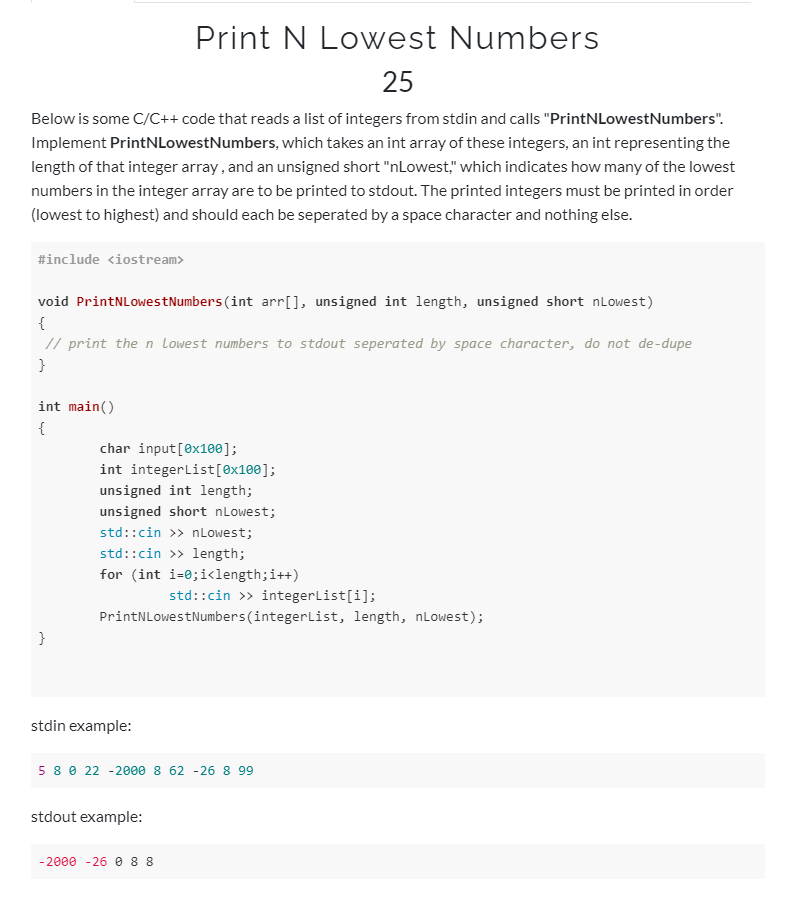

## Challenge

## Solution
```C
void PrintNLowestNumbers(int arr[], unsigned int length, unsigned short nLowest)
{
	// print the n lowest numbers to stdout seperated by space character, do not de-dupe
	for (int j = 1; j < length; ++j)
	{
		int x = arr[j];
		int i;
		for (i = j - 1; i >= 0 && arr[i] > x; --i)
			arr[i + 1] = arr[i];
		arr[i + 1] = x;
	}
	for (int i = 0; i < nLowest; ++i)
	{
		std::cout << arr[i] << " ";
	}
}
```
